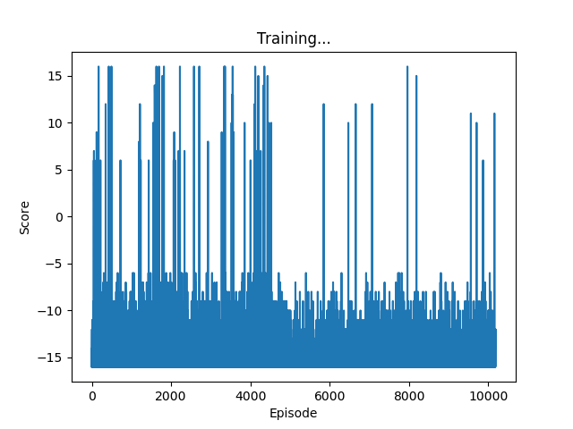
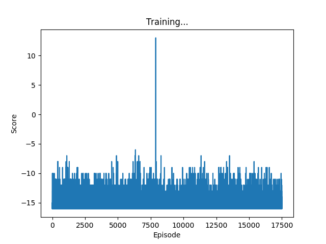
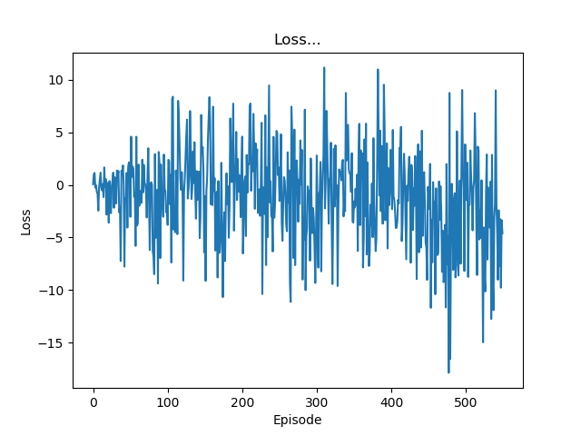
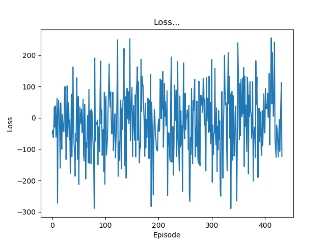

<meta charset="utf-8">
# SURE Journal #

Goal: To create some deep learning architecture that can recreate video game frames
when given the previous frame and the player's inputs at that frame
## February 2018 ##
*February 7*

Tasks Accomplished:
1. Find Pong Emulator/Game
  1. This is because a simple 2D game is needed for data generation
2. Figure out how to have the game play itself
  1. This is so that the getting data can be done automatically

*February 8*

Tasks Accomplished:
1. Finished random computer player class
  1. This is so that the data generated will be random
2. Finished setting up the game to save the data and write to a .csv file automatically
  1. This is so that the data can be saved and run through some learning architecture later

TODO:
1. Email Derek about what the next step is

## May 2018 ##
*May 2-3*

Tasks Accomplished:
1. Created automatic graph generator in order to better understand how Q learning works by using RL to find the shortest path

TODO:
1. Connect this with pong, get pong to use RL to play itself

*May 4*

Tasks Accomplished:
1. Ran the PyTorch RL tutorial to understand it better as it is a similar problem to Pong (moving cart)

TODO:
1. Need to better understand how the tutorial uses the previous and current frames to get the state and how it uses that state to decide what to do and how it does the action

*May 7*

Tasks Accomplished:
1. Pretty much understand the tutorial, have almost completed merging elements of the tutorial with the Pong game
2. Wrote the reward and perform_action methods needed
3. Because the tutorial uses Gym, I have added methods that do what the Gym environment did for the tutorial (reward, action, done)

TODO:
1. Still need to figure out how to size the layers, am currently getting a size error when convolving.

*May 8*

Tasks Accomplished:
1. Figured out why the layers end up sizing the way they do. Involves kernel_size and stride parameters, which change the output matrix size
2. Got the Q-Learning Pong game to run, but it is much too slow on my CPU to be meaningful, will have to find a way to get it running on a modern GPU

TODO:
1. Find access to GPU
2. Finish up the Q-Learning Pong game to make sure that it resets properly in between episodes, etc.

*May 9*

Tasks Accomplished:
1. Ran the Q-Learning Pong game all day, with the Q-Learning player facing off against a "perfect" player - a player whose paddle always follows the ball.
Each episode of training was a best-of-three, and in total 36 episodes were completed.

TODO:
1. Still need a GPU. I can't tell if it is learning from 36 episodes, I wuld have to run it for hundreds see any improvement.

*May 10-18*

Now have access to Compute Canada research cluster. Spent a little over a week learning how to use it and fixing and setting up my environment.

It seems to be about twice as fast or more to run it on their cluster. I tried to run it using the DataParallel module in PyTorch on 2 GPUs and it was much slower, probably means that it isn't well suited for multiprogramming whether because of the size of the data or something else.

Tasks Accomplished:
1. Added a checkpoint save to QLearningPong.py so that I can continue where I left off training it. Also takes care of saving the model and saving the graph of the durations that the Q-Learning algorthm lasts against the perfect opponent.

TODO: Just need to keep running it to see if any improvements can be made. It would be great to be able to speed it up, but I don't know what I would do to speed it up.

*May 19-20*

Have been training the Q-LEarning algorithm with stride = 5 and kernel = 5 for all convolution layers. Here is a graph of 100 games played versus duration it stayed alive:

As you can see there is no learning going on. Will test stride=5, 4, and 2 respectively for the first, second, and third convolution layers.

*May 24-31*
Was back home, and CEDAR was down so I was unable to run anything. However, I did some research on potential improvements I could make in ordr to get the NN to learn.

The first was using a Double DQN: https://medium.com/@awjuliani/simple-reinforcement-learning-with-tensorflow-part-4-deep-q-networks-and-beyond-8438a3e2b8df

After looking through more closely at the tutorial code, it seems like it already does this.

*June 4*

Servers are back up, am now able to run things. I found an [article](https://medium.com/mlreview/speeding-up-dqn-on-pytorch-solving-pong-in-30-minutes-81a1bd2dff55)
that explains how this guy "solved" pong using a DQN, and I will try using his parameters to see if it helps me.

*June 5-12*

A lot of updates. Using a new Pong environment called [PLE](https://github.com/ntasfi/PyGame-Learning-Environment) for DL. The episodes train MUCH faster now because of it, as it runs headless. Now I have a different problem, the network does not learn. It immediately drops to scoring no points and remains that way forever.

I have been looking for other tutorials such as [this](https://becominghuman.ai/lets-build-an-atari-ai-part-1-dqn-df57e8ff3b26) in order to see if it is a problem with my training loop, however it appears that what I have is very similar to what other people have used.

*June 14*

I have made a simplified version of the code that just learns from one best-of-11 game that I saved the images from. It seems to be able to learn, as the loss decreases very quickly and gets very low.

The next step is to use it to actually play Pong and see if it learns anything.

*June 15-20*

I started with the simplified version playing Pong using PLE. As expected, it learned pretty much nothing, as it was missing many features that help DQNs converge.

I started adding these elements one at a time to see if it would improve its performance, such as replayable memory. Unfortunately, the DQN still is failing to master Pong.

*June 21-July 4*

Went back home to visit family, but still worked. I read about a technique where instead of passing single frames, you pass in groups of 4 frames in order to teach the DQN about velocity so that it can tell whether the ball is moving towards or away from it.
I have implemented this, and it seems like it is better than before. However, it still does not converge. I have also added a second linear layer, and it seems to do a bit better, but again it does not converge. Another technique I have implemented is skipping frames. I only feed every fourth frame to the DQN, as sequential frames generally do not have a large difference between them and it can slow down teaching the DQN.

Here is a graph of my current best-working DQN. I have run it for approximately 10,000 games.

*July 5-10*

I briefly considered trying to use a RNN after reading an article about OpenAI's Dota 2 bot, which uses a LSTM RNN architecture. [Here is the article](https://blog.openai.com/openai-five/).
However, after doing some research to see how you could feed images to a RNN, I found [this](https://arxiv.org/pdf/1505.00393.pdf) paper that details exactly that.
OpenAI's agent does not process images, and so their problem is very different from mine. They feed a matrix that represents actions the bot can take on entities around them. I began trying to implement what the paper said was a good way to feed images to a RNN, but I couldn't quite figure out some of the intricacies, and I do not believe it would perform any better regardless.

I have been running some alternate DQNs alongside each other to see how they compare.

Here is a DQN with a single linear layer instead of two.

I think that the two linear layer model is better, and I am going to keep training it in the hopes of it converging. I talked to Isaac about it and he said something that I have seen while reading about the subject.
It is hard to make reinforcement learning algorithms converge, and they generally need a lot of time. So, I hope that is I keep running my two linear layer model it will converge.

*July 11-12*

I have started to think about whether the PLE game window is so simple that my convolution layers are destroying them. It is a tiny window, something like 64 x 82 pixels, and so I have created a version of my DQN that uses Gym instead.
The GYM Pong window is a much larger 160 x 240, and I am suspecting that it may work better with my convolution layers.
I have made an implementation of the DQN using Gym, and I will run it for a while and see how it does.

*July 13 - 25*

I have been looking through the resources Derek sent me. In particular, Google's implementation of a reinforcement learning version of Pong was pretty informative. I decided to try to
translate their Tensorflow code into PyTorch code, and I have taken their reward discounting function to use in my implementations to see if it improves them.

A strange thing I have noticed looking at Google's loss is that their loss starts at about zero, and then nicely curves downwards into the negatives, while mine jumps back and forth across the zero axis. I have verified that I am using the correct loss function, and after looking closely at every part of the code I cannot figure out how their loss acts this way. Tensorflow must do some stuff behind the scenes that I do not know about.

I have also found an implementation of Cart-Pole using the Reinforce algorithm that Derek sent me a paper about. After running it myself, and looking at the loss function, their
loss happens to also jump across the zero axis over and over, so the fact that my loss does this might be ok after all. I have made an implementation of Pong using the Reinforce algorithm, and we will see whether it works out.

<!-- Markdeep: -->
