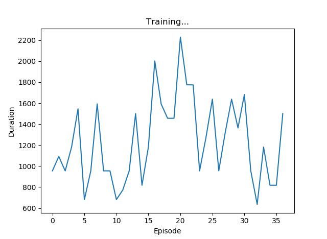
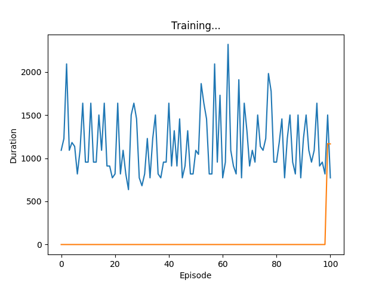
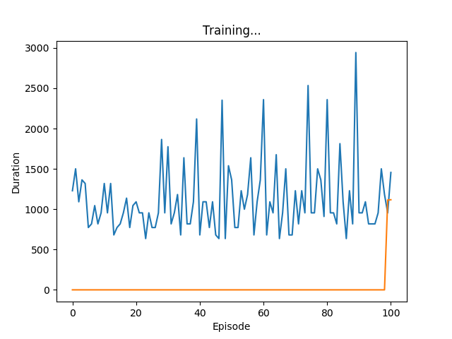

<meta charset="utf-8">
# SURE Journal #

Goal: To create some deep learning architecture that can recreate video game frames
when given the previous frame and the player's inputs at that frame
## February 2018 ##
*February 7*

Tasks Accomplished:
1. Find Pong Emulator/Game
  1. This is because a simple 2D game is needed for data generation
2. Figure out how to have the game play itself
  1. This is so that the getting data can be done automatically

*February 8*

Tasks Accomplished:
1. Finished random computer player class
  1. This is so that the data generated will be random
2. Finished setting up the game to save the data and write to a .csv file automatically
  1. This is so that the data can be saved and run through some learning architecture later

TODO:
1. Email Derek about what the next step is

## May 2018 ##
*May 2-3*

Tasks Accomplished:
1. Created automatic graph generator in order to better understand how Q learning works by using RL to find the shortest path

TODO:
1. Connect this with pong, get pong to use RL to play itself

*May 4*

Tasks Accomplished:
1. Ran the PyTorch RL tutorial to understand it better as it is a similar problem to Pong (moving cart)

TODO:
1. Need to better understand how the tutorial uses the previous and current frames to get the state and how it uses that state to decide what to do and how it does the action

*May 7*

Tasks Accomplished:
1. Pretty much understand the tutorial, have almost completed merging elements of the tutorial with the Pong game
2. Wrote the reward and perform_action methods needed
3. Because the tutorial uses Gym, I have added methods that do what the Gym environment did for the tutorial (reward, action, done)

TODO:
1. Still need to figure out how to size the layers, am currently getting a size error when convolving.

*May 8*

Tasks Accomplished:
1. Figured out why the layers end up sizing the way they do. Involves kernel_size and stride parameters, which change the output matrix size
2. Got the Q-Learning Pong game to run, but it is much too slow on my CPU to be meaningful, will have to find a way to get it running on a modern GPU

TODO:
1. Find access to GPU
2. Finish up the Q-Learning Pong game to make sure that it resets properly in between episodes, etc.

*May 9*

Tasks Accomplished:
1. Ran the Q-Learning Pong game all day, with the Q-Learning player facing off against a "perfect" player - a player whose paddle always follows the ball.
Each episode of training was a best-of-three, and in total 36 episodes were completed.

TODO:
1. Still need a GPU. I can't tell if it is learning from 36 episodes, I wuld have to run it for hundreds see any improvement.

*May 10-18*

Now have access to Compute Canada research cluster. Spent a little over a week learning how to use it and fixing and setting up my environment.

It seems to be about twice as fast or more to run it on their cluster. I tried to run it using the DataParallel module in PyTorch on 2 GPUs and it was much slower, probably means that it isn't well suited for multiprogramming whether because of the size of the data or something else.

Tasks Accomplished:
1. Added a checkpoint save to QLearningPong.py so that I can continue where I left off training it. Also takes care of saving the model and saving the graph of the durations that the Q-Learning algorthm lasts against the perfect opponent.

TODO: Just need to keep running it to see if any improvements can be made. It would be great to be able to speed it up, but I don't know what I would do to speed it up.

*May 19-20*

Have been training the Q-LEarning algorithm with stride = 5 and kernel = 5 for all convolution layers. Here is a graph of 100 games played versus duration it stayed alive:

As you can see there is no learning going on. Will test stride=5, 4, and 2 respectively for the first, second, and third convolution layers.

*May 24-31*
Was back home, and CEDAR was down so I was unable to run anything. However, I did some research on potential improvements I could make in ordr to get the NN to learn.

The first was using a Double DQN: https://medium.com/@awjuliani/simple-reinforcement-learning-with-tensorflow-part-4-deep-q-networks-and-beyond-8438a3e2b8df

After looking through more closely at the tutorial code, it seems like it already does this.

*June 4*

Servers are back up, am now able to run things. I found an [article](https://medium.com/mlreview/speeding-up-dqn-on-pytorch-solving-pong-in-30-minutes-81a1bd2dff55)
that explains how this guy "solved" pong using a DQN, and I will try using his parameters to see if it helps me. 

<!-- Markdeep: -->
